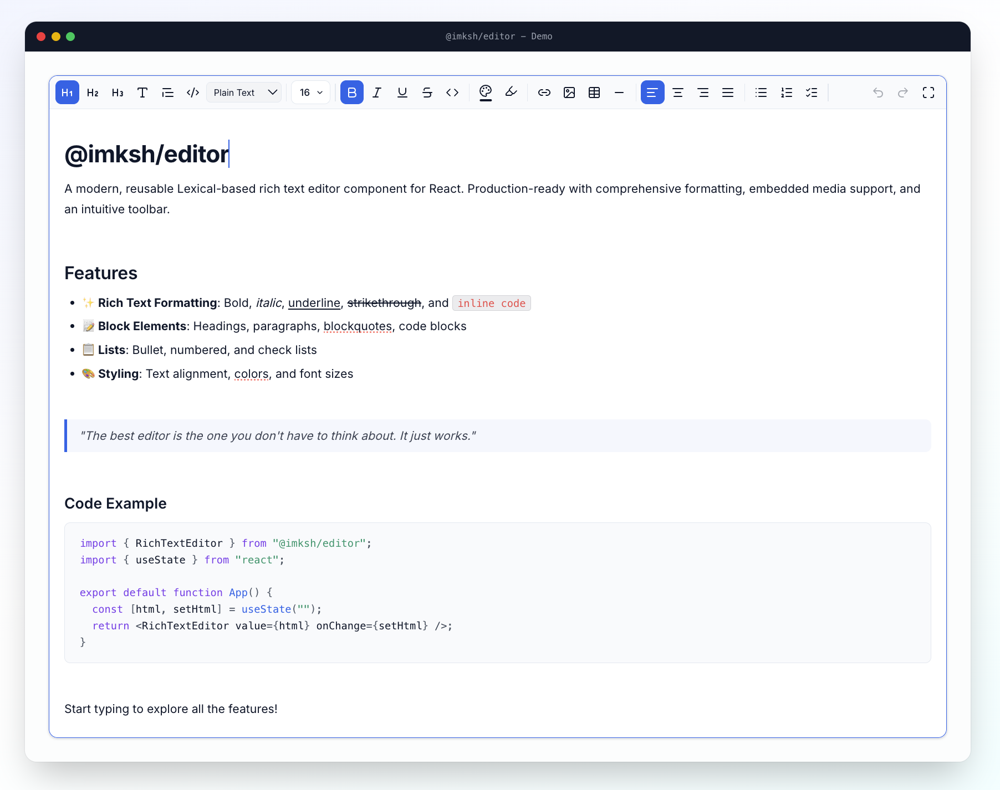
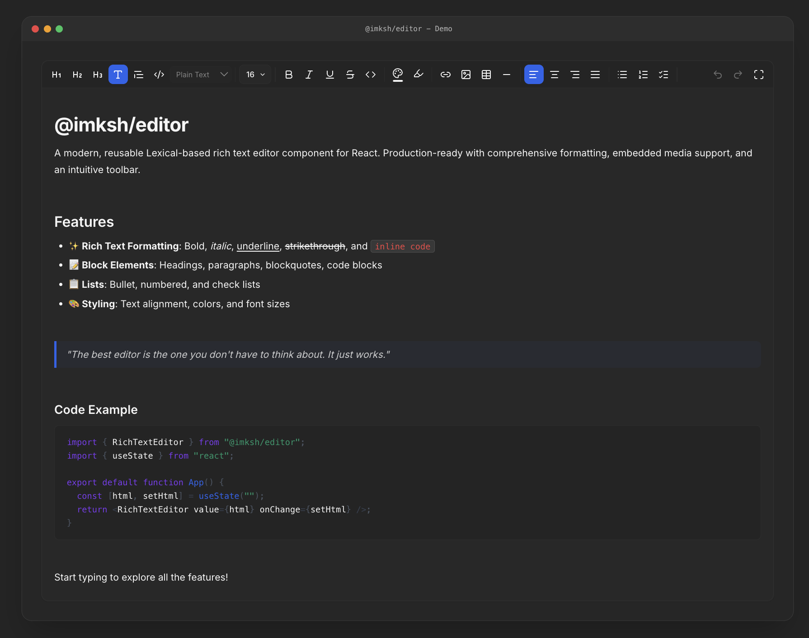

# @imksh/editor

A modern, reusable Lexical-based rich text editor component for React. Production-ready with comprehensive formatting, embedded media support, and an intuitive toolbar.


## Screenshots

### Light Theme



### Dark Theme



## Features

- ✨ **Rich Text Formatting**: Bold, italic, underline, strikethrough, inline code
- 📝 **Block Elements**: Headings, paragraphs, blockquotes, code blocks
- 📋 **Lists**: Bullet, numbered, and check lists
- 🔗 **Links & Media**: Link insertion, image insertion, and image editing with built-in dialogs or external drawers
- 📊 **Tables**: Full table support with add/remove rows and columns
- 🎨 **Styling**: Font size, text color, background highlight, alignment
- ⌨️ **Keyboard Shortcuts**: Full keyboard support including undo/redo
- 🎯 **Dynamic Responsive Toolbar**: Intelligently collapses formatting groups into dropdowns as screen width decreases, driven entirely by CSS Container Queries for zero-lag performance.
- 🪟 **Fullscreen Mode**: Built-in toggle to expand the editor to the full screen.
- 🔄 **HTML I/O**: Import and export as HTML
- 💾 **Auto-Save**: Built-in debounced auto-save plugin (if applicable)
- ♿ **Accessible**: Semantic HTML and keyboard navigation

## Installation

```bash
npm install @imksh/editor
```

### Peer Dependencies

Make sure you have React and Lexical installed:

```bash
npm install react react-dom lexical @lexical/react @lexical/rich-text @lexical/list @lexical/link @lexical/code @lexical/table @lexical/html @lexical/selection @lexical/utils @lexical/markdown prismjs lucide-react
```

## Quick Start

### Basic Usage

```tsx
import { RichTextEditor } from "@imksh/editor";
import "@imksh/editor/style.css"; // Essential for toolbar layout and responsiveness
import { useState } from "react";

export default function MyComponent() {
  const [html, setHtml] = useState("<p>Hello world</p>");

  return (
    <RichTextEditor
      value={html}
      onChange={setHtml}
      placeholder="Start typing..."
      minHeight={400}
    />
  );
}
```

### With Feature Flags

```tsx
<RichTextEditor
  value={html}
  onChange={setHtml}
  // Disable specific features
  table={false}
  image={false}
  codeBlock={false}
  // Styling
  minHeight={300}
  maxHeight={600} // Enables internal scroll with sticky toolbar
  className="my-editor"
/>
```

### With Custom Image Upload Handler

If you want the editor to handle file uploads when the user selects a local file, provide the `onImageUpload` prop.

```tsx
<RichTextEditor
  value={html}
  onChange={setHtml}
  onImageUpload={async (file) => {
    // Upload file to your server
    const formData = new FormData();
    formData.append("file", file);
    const response = await fetch("/api/upload", {
      method: "POST",
      body: formData,
    });
    const data = await response.json();
    return data.url; // Return the hosted image URL
  }}
/>
```

### With External Image Drawer / Media Gallery

If your app already has an external media gallery or image drawer, you can completely bypass the editor's default image dialog by providing `onOpenImageDrawer`. When the user clicks the Image icon in the toolbar, your custom callback is triggered.

```tsx
<RichTextEditor
  value={html}
  onChange={setHtml}
  onOpenImageDrawer={(insertImageCallback) => {
    // 1. Open your custom media drawer UI here
    setMyMediaDrawerOpen(true);

    // 2. Save the insertImageCallback somewhere so you can call it later
    // When the user selects an image in your drawer, simply call:
    // insertImageCallback("https://my-domain.com/selected-image.jpg");
  }}
/>
```

## Image Editing

After an image is inserted, selecting it opens a floating image toolbar with quick actions:

- Align left, center, or right
- Replace the image source
- Delete the image node

If `onOpenImageDrawer` is provided, both the insert flow and the replace flow can hand off to your own media picker. If not, the editor falls back to a URL prompt for replacement.

The editor also ships with screenshot assets in `docs/images` that you can use in your own docs or demos:

## API Reference

### Props

| Prop                | Type                                        | Default              | Description                                         |
| ------------------- | ------------------------------------------- | -------------------- | --------------------------------------------------- |
| `value`             | `string`                                    | `''`                 | Initial HTML content                                |
| `onChange`          | `(html: string) => void`                    | —                    | Fires when content changes (debounced 300ms)        |
| `placeholder`       | `string`                                    | `'Start writing...'` | Placeholder text when empty                         |
| `readOnly`          | `boolean`                                   | `false`              | Read-only mode (disables editing and hides toolbar) |
| `autoFocus`         | `boolean`                                   | `false`              | Auto-focus the editor on mount                      |
| `minHeight`         | `number \| string`                          | `200`                | Minimum editor height                               |
| `maxHeight`         | `number \| string`                          | —                    | Maximum editor height (enables internal scroll)     |
| `height`            | `number \| string`                          | —                    | Fixed editor height (enables internal scroll)       |
| `disabled`          | `boolean`                                   | `false`              | Disable editing (grayed-out appearance)             |
| `showToolbar`       | `boolean`                                   | `true`               | Show/hide the toolbar                               |
| `className`         | `string`                                    | `''`                 | Additional CSS class on wrapper                     |
| `onImageUpload`     | `(file: File) => Promise<string>`           | —                    | Image upload handler (returns image URL)            |
| `onOpenImageDrawer` | `(callback: (url: string) => void) => void` | —                    | Custom external image picker integration            |

### Feature Flags

All features are **enabled by default**. Set any to `false` to disable it from the toolbar and the editor completely:

| Flag             | Type      | Default |
| ---------------- | --------- | ------- |
| `bold`           | `boolean` | `true`  |
| `italic`         | `boolean` | `true`  |
| `underline`      | `boolean` | `true`  |
| `strikethrough`  | `boolean` | `true`  |
| `inlineCode`     | `boolean` | `true`  |
| `codeBlock`      | `boolean` | `true`  |
| `headings`       | `boolean` | `true`  |
| `fontSize`       | `boolean` | `true`  |
| `textColor`      | `boolean` | `true`  |
| `highlight`      | `boolean` | `true`  |
| `alignment`      | `boolean` | `true`  |
| `bulletList`     | `boolean` | `true`  |
| `numberedList`   | `boolean` | `true`  |
| `checkList`      | `boolean` | `true`  |
| `blockquote`     | `boolean` | `true`  |
| `link`           | `boolean` | `true`  |
| `image`          | `boolean` | `true`  |
| `table`          | `boolean` | `true`  |
| `horizontalRule` | `boolean` | `true`  |
| `undoRedo`       | `boolean` | `true`  |

### Example: Minimal Editor

```tsx
<RichTextEditor
  value={html}
  onChange={setHtml}
  headings={false}
  fontSize={false}
  textColor={false}
  highlight={false}
  table={false}
  image={false}
  link={false}
/>
```

### Example: Full-Featured Editor

```tsx
<RichTextEditor
  value={html}
  onChange={setHtml}
  minHeight={300}
  maxHeight={600}
  showToolbar={true}
  bold={true}
  italic={true}
  underline={true}
  strikethrough={true}
  inlineCode={true}
  codeBlock={true}
  headings={true}
  fontSize={true}
  textColor={true}
  highlight={true}
  alignment={true}
  bulletList={true}
  numberedList={true}
  checkList={true}
  blockquote={true}
  link={true}
  image={true}
  table={true}
  horizontalRule={true}
  undoRedo={true}
/>
```

## Keyboard Shortcuts

| Shortcut               | Action                        |
| ---------------------- | ----------------------------- |
| `Ctrl/Cmd + B`         | Bold                          |
| `Ctrl/Cmd + I`         | Italic                        |
| `Ctrl/Cmd + U`         | Underline                     |
| `Ctrl/Cmd + Shift + X` | Strikethrough                 |
| `Ctrl/Cmd + E`         | Center align                  |
| `Ctrl/Cmd + L`         | Left align                    |
| `Ctrl/Cmd + R`         | Right align                   |
| `Ctrl/Cmd + J`         | Justify                       |
| `Ctrl/Cmd + Z`         | Undo                          |
| `Ctrl/Cmd + Shift + Z` | Redo                          |
| `Tab`                  | Insert tab in code blocks     |
| `Escape`               | Exit code block or Fullscreen |

## Styling

The editor comes with default styles. To customize, you can:

1. **Override CSS variables** (coming soon)
2. **Use the `className` prop** for wrapper styling
3. **Import styles (Required for Toolbar Layout)**:

```tsx
import "@imksh/editor/style.css";
```

## Browser Support

- Chrome (latest)
- Firefox (latest)
- Safari (latest)
- Edge (latest)

## License

MIT © 2024 Karan Sharma

## Contributing

Contributions are welcome! Please feel free to submit a Pull Request.

## Support

For issues, questions, or suggestions, please open an issue on [GitHub](https://github.com/imksh/editor).

---

Made with ❤️ by [Karan Sharma](https://github.com/imksh)
